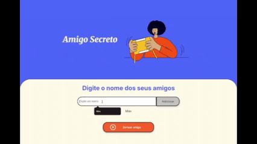

<h1 align="center">Challenge Amigo Secreto</h1>

Uma aplicação web desenvolvida como parte de um desafio técnico do projeto Oracle Next Education (ONE) da Oracle em parceria com a Alura Latam. O objetivo é criar uma aplicação para o sorteio de um amigo secreto. O desafio consiste em:
* Criar um array para armazenar os nomes inseridos pelo usuário;
* Implementar uma função para agregar os nomes ao array;
* Implementar uma função para atualizar a lista no HTML;
* Implementar uma função para sortear os amigos.
  
<h2 align="center">📸 Demonstração</h2>

  

  🎮 <a href="https://challange-amigo-secreto-orpin.vercel.app/" target="_blank">Clique aqui para jogar</a>

## :hammer_and_wrench: Tecnologias

  HTML → Responsável por estruturar a página, criando a base do conteúdo que aparece na tela. 
 
  CSS → Usado para estilizar e deixar o projeto visualmente agradável, com cores, fontes e organização. 
 
  JavaScript → Responsável por dar vida à aplicação, permitindo interatividade, lógica do sorteio e dinamismo. 

 
## :rocket: Funcionalidades
* **Adicionar:** O nome digiado é adiconado a lista de amigos a ser sorteada.
* **Sortear Amigo:** Um amigo da lista é sorteado e indicado na tela para o usuário.
* **Alert:** Um alerta aparece na tela quando nenhum nome foi digitado.

## :bulb: Melhorias Futuras
* Melhorar a interface do usuário.
* Habilitar um botão para reiniciar o jogo.
* Habilitar um botão para remover um nome da lista".

## :scroll: Licença
Projeto realizado para fins de avaliação.
